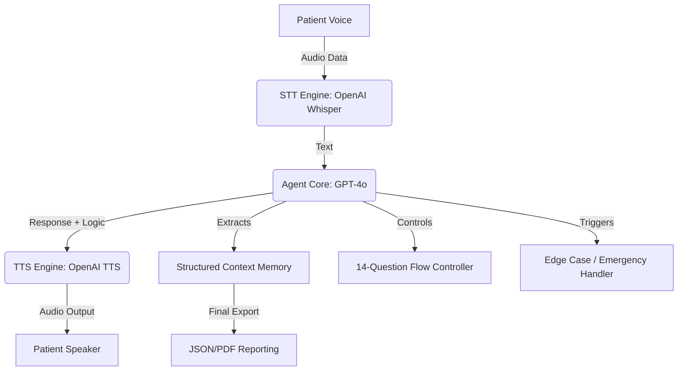

# 🎙️ CareCaller AI Voice Agent Simulator

CareCaller is a state-of-the-art **AI Voice Agent Simulator** designed specifically for healthcare medication check-ins. It bridges the gap between automated health monitoring and human-like interaction by providing a low-latency, empathetic voice interface for patient follow-ups.

---

## 🌟 Overview

CareCaller automates the process of checking in with patients regarding their medication adherence, side effects, and overall well-being. Built for the 2026 Healthcare Innovation Hackathon, it demonstrates how AI can reduce the burden on healthcare providers while maintaining high-quality patient care.

### 🎯 Key Objectives
- **Automate Routine Checks**: Handle regular refill and health status inquiries.
- **Ensure Patient Safety**: Detect emergencies and severe symptoms in real-time.
- **structured Data Extraction**: Convert natural conversations into clinical-grade JSON reports.
- **Maintain Privacy**: Built-in identity verification flow for every call.

---

## 🏗️ Architecture

CareCaller uses a modular architecture to process audio and maintain state:



---

## 🚀 Key Features

### 📋 14-Point Health Questionnaire
The agent gracefully guides patients through a comprehensive health check, covering:
- **Medication Adherence**: Tracking if meds are taken as prescribed.
- **Side Effects & Allergies**: Detecting adverse reactions early.
- **Vital Signs**: Recording weight and blood pressure checks.
- **Clinical Status**: Recent hospitalizations or doctor visits.
- **Quality of Life**: Sleep, appetite, and general concerns.

### 🧠 Advanced Agent Intelligence
- **Context-Aware Memory**: Remembers patient details and previous turns within the call.
- **Identity Verification**: Multi-step flow to ensure conversations only happen with the intended patient.
- **Emergency Detection**: Listens for critical keywords (e.g., "chest pain", "shortness of breath") to trigger immediate escalation.
- **Empathetic Interaction**: Uses natural, professional language tailored for healthcare settings.

### 📄 Professional Reporting
At the end of every call, CareCaller generates:
- **PDF Summary**: A professional, human-readable report including patient info and conversation highlights.
- **Structured JSON**: Machine-readable data for integration with EHR (Electronic Health Record) systems.
- **Analytics Dashboard**: (Coming Soon) Visualization of patient trends and population health metrics.

---

## 🛠️ Technical Stack

- **Lanuage**: [Python 3.9+](https://www.python.org/)
- **Frontend/UI**: [Streamlit](https://streamlit.io/)
- **LLM Core**: [OpenAI GPT-4o / GPT-4o-mini](https://openai.com/)
- **STT (Speech-to-Text)**: [OpenAI Whisper](https://openai.com/research/whisper)
- **TTS (Text-to-Speech)**: [OpenAI TTS](https://platform.openai.com/docs/guides/text-to-speech)
- **Reporting**: `fpdf2` (PDF), `pandas` (Data handling)
- **Audio Processing**: `sounddevice`, `pygame`, `numpy`

---

## 📂 Project Structure

```text
├── final_simulator.py      # Main Entry Point (Streamlit UI)
├── agent_core.py           # Central AI Agent Logic & LLM Orchestration
├── stt_engine.py           # Speech-to-Text processing
├── tts_engine.py           # Text-to-Speech generation
├── question_controller.py  # Structured healthcare flow management
├── context_memory.py       # Patient profile & history tracking
├── validation_system.py    # Call quality and compliance checks
├── response_storage.py     # Data logging and export utilities
├── edge_case_handler.py    # Emergency & off-script logic
└── requirements.txt        # Project dependencies
```

---

## 🚀 How to Run

### 1. Prerequisites
Ensure you have Python 3.9+ installed and an OpenAI API Key.

### 2. Clone the Repository
```bash
git clone https://github.com/varunmax7/CareCallerAI.git
cd CareCallerAI
```

### 3. Install Dependencies
```bash
pip install -r requirements.txt
```

### 4. Setup Environment
Create a `.env` file in the root directory:
```env
OPENAI_API_KEY=your_sk_key_here
```

### 5. Launch the Simulator
```bash
streamlit run final_simulator.py
```

---

## 🛡️ Identity & Safety
CareCaller is a **simulator**. In a production environment, it would be integrated with HIPAA-compliant providers and authenticated through secure API gateways. Always consult a healthcare professional for medical advice.

---
Built with ❤️ by [Varun](https://github.com/varunmax7) for the 2026 Hackathon.

